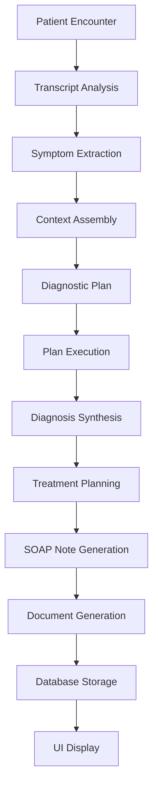

# Foresight CDSS - Post-Refactor Architecture

## Overview

This document describes the current state of the Foresight CDSS after the comprehensive FHIR-aligned refactoring. The system now features a fully functional clinical decision support pipeline with proper data normalization and AI-powered diagnostic capabilities.

## Database Architecture

### Core Tables

The system is built around four main FHIR-aligned tables:

#### 1. Patients Table
```sql
CREATE TABLE public.patients (
  id UUID PRIMARY KEY DEFAULT gen_random_uuid(),
  patient_id TEXT UNIQUE NOT NULL,
  first_name TEXT,
  last_name TEXT,
  name TEXT,
  gender TEXT,
  birth_date DATE,
  race TEXT,
  ethnicity TEXT,
  marital_status TEXT,
  language TEXT,
  photo_url TEXT,
  poverty_percentage NUMERIC,
  alerts JSONB,
  next_appointment_date TIMESTAMPTZ,
  patient_level_reason TEXT,
  created_at TIMESTAMPTZ DEFAULT now(),
  updated_at TIMESTAMPTZ DEFAULT now(),
  extra_data JSONB
);
```

**Key Changes from Legacy:**
- Removed `primary_diagnosis_description` and `general_diagnosis_details` (migrated to conditions table)
- Added `ethnicity` field for FHIR compliance
- Standardized `birth_date` field name

#### 2. Encounters Table (formerly visits/admissions)
```sql
CREATE TABLE public.encounters (
  id UUID PRIMARY KEY DEFAULT gen_random_uuid(),
  encounter_id TEXT NOT NULL,
  patient_supabase_id UUID REFERENCES public.patients(id) ON DELETE CASCADE,
  encounter_type TEXT,
  reason_code TEXT,
  reason_display_text TEXT,
  scheduled_start_datetime TIMESTAMPTZ,
  scheduled_end_datetime TIMESTAMPTZ,
  actual_start_datetime TIMESTAMPTZ,
  actual_end_datetime TIMESTAMPTZ,
  transcript TEXT,
  soap_note TEXT,
  treatments JSONB,
  prior_auth_justification TEXT,
  status TEXT DEFAULT 'planned',
  is_deleted BOOLEAN DEFAULT false,
  created_at TIMESTAMPTZ DEFAULT now(),
  updated_at TIMESTAMPTZ DEFAULT now(),
  extra_data JSONB
);
```

**Key Changes from Legacy:**
- Renamed from `visits`/`admissions` to `encounters` for FHIR alignment
- `admission_type` → `encounter_type`
- `reason_for_visit` → `reason_display_text`
- Added `reason_code` for structured coding
- Added `status` and `is_deleted` for proper lifecycle management

#### 3. Conditions Table
```sql
CREATE TABLE public.conditions (
  id UUID PRIMARY KEY DEFAULT gen_random_uuid(),
  patient_id UUID REFERENCES public.patients(id) ON DELETE CASCADE,
  encounter_id UUID REFERENCES public.encounters(id) ON DELETE CASCADE,
  code TEXT,
  description TEXT NOT NULL,
  category TEXT DEFAULT 'problem-list',
  onset_date DATE,
  note TEXT,
  created_at TIMESTAMPTZ DEFAULT now(),
  updated_at TIMESTAMPTZ DEFAULT now()
);
```

**Purpose:** Stores all diagnoses and medical conditions in a structured, FHIR-aligned format.

#### 4. Lab Results Table
```sql
CREATE TABLE public.lab_results (
  id UUID PRIMARY KEY DEFAULT gen_random_uuid(),
  patient_id UUID REFERENCES public.patients(id) ON DELETE CASCADE,
  encounter_id UUID REFERENCES public.encounters(id) ON DELETE CASCADE,
  name TEXT NOT NULL,
  value TEXT NOT NULL,
  units TEXT,
  date_time TIMESTAMPTZ,
  reference_range TEXT,
  flag TEXT,
  created_at TIMESTAMPTZ DEFAULT now(),
  updated_at TIMESTAMPTZ DEFAULT now()
);
```

**Purpose:** Stores laboratory results and observations in a structured format with proper units and reference ranges.

#### 5. Differential Diagnoses Table (New)
```sql
CREATE TABLE public.differential_diagnoses (
  id UUID PRIMARY KEY DEFAULT gen_random_uuid(),
  patient_id UUID REFERENCES public.patients(id) ON DELETE CASCADE,
  encounter_id UUID REFERENCES public.encounters(id) ON DELETE CASCADE,
  diagnosis_name TEXT NOT NULL,
  likelihood TEXT NOT NULL,
  key_factors TEXT,
  rank_order INTEGER DEFAULT 1,
  created_at TIMESTAMPTZ DEFAULT now(),
  updated_at TIMESTAMPTZ DEFAULT now()
);
```

**Purpose:** Stores differential diagnoses generated by the clinical engine, allowing for proper tracking and display of diagnostic considerations.

### Removed Legacy Elements

The following problematic elements have been removed:
- `admissions` view (was a duplicate of encounters)
- `test_data_summary` view (replaced with proper data queries)
- Deprecated diagnosis fields in patients table

## Clinical Engine Architecture

### Overview

The clinical engine (Tool B) is now fully functional and provides end-to-end diagnostic support:

```
Patient Data → Symptom Extraction → Diagnostic Plan → Diagnosis Synthesis → Output Generation → Database Storage
```

### Pipeline Stages

#### 1. Patient Context Loading
- Assembles complete patient context from all FHIR-aligned tables
- Includes demographics, conditions, lab results, and encounter history
- Creates `FHIRPatientContext` object for processing

#### 2. Symptom Extraction
- Analyzes encounter transcripts to extract key symptoms
- Uses pattern matching and clinical reasoning
- Stores extracted symptoms in encounter metadata

#### 3. Diagnostic Plan Generation
- Creates structured diagnostic plans based on symptoms and patient context
- Tailors plans for specific clinical scenarios (autoimmune, cardiac, etc.)
- Includes rationale for diagnostic approach

#### 4. Plan Execution
- Executes diagnostic steps with mock clinical reasoning
- Incorporates patient history, lab results, and clinical guidelines
- Generates findings for each diagnostic step

#### 5. Diagnosis Synthesis
- Synthesizes primary diagnosis with confidence scoring
- Generates differential diagnoses with likelihood assessment
- Considers patient-specific factors and clinical context

#### 6. Treatment Planning
- Generates evidence-based treatment recommendations
- Considers patient allergies, contraindications, and preferences
- Includes rationale for each treatment decision

#### 7. SOAP Note Generation
- Creates structured clinical documentation
- Incorporates all findings and recommendations
- Follows standard medical documentation format

#### 8. Document Generation
- Generates referral letters when appropriate
- Creates prior authorization requests for treatments
- Includes all necessary clinical justification

#### 9. Database Storage
- Saves primary diagnosis to conditions table
- Stores differential diagnoses in dedicated table
- Updates encounter with SOAP note and treatments
- Maintains audit trail of all clinical decisions

### Data Flow



## Key Benefits of Refactored Architecture

### 1. FHIR Alignment
- Field names and structures align with FHIR US Core profiles
- Ready for EHR integration
- Supports standard healthcare data exchange

### 2. Structured Diagnosis Storage
- Diagnoses stored separately from patient demographics
- Proper ICD coding support
- Encounter-specific diagnosis tracking

### 3. Differential Diagnoses Support
- Dedicated table for storing and tracking differentials
- Likelihood assessment and ranking
- Clinical reasoning documentation

### 4. Normalized Lab Results
- Structured storage with units and reference ranges
- Abnormal value flagging
- Temporal tracking of results

### 5. End-to-End AI Workflow
- Complete diagnostic pipeline from transcript to documentation
- Clinician review and approval workflow
- Structured output storage

### 6. Minimal Schema Bloat
- Only essential fields for MVP functionality
- Clean separation of concerns
- Extensible design for future enhancements

## Clinical Workflow

### Current State Workflow

1. **Patient Selection**: Clinician selects patient from dashboard
2. **Encounter Creation**: New consultation encounter is created
3. **Data Collection**: Transcript, observations, and clinical data gathered
4. **AI Analysis**: Clinical engine processes all available data
5. **Results Review**: Clinician reviews AI-generated diagnosis and recommendations
6. **Approval/Editing**: Clinician can modify or approve AI suggestions
7. **Documentation**: Final results saved to structured database tables
8. **Follow-up**: Results available for future encounters and analysis

### Integration Points

- **Supabase Database**: All data persistence and retrieval
- **OpenAI API**: AI-powered analysis and generation
- **React Frontend**: User interface and interaction
- **TypeScript Services**: Business logic and data transformation

## Future Enhancements

### Planned Improvements

1. **Real LLM Integration**: Replace mock logic with actual AI models
2. **Clinical Guidelines Integration**: Incorporate evidence-based guidelines
3. **Drug Interaction Checking**: Advanced medication safety
4. **Clinical Trial Matching**: Automated trial eligibility assessment
5. **Quality Metrics**: Clinical decision quality tracking

### EHR Integration Readiness

The current architecture is designed for seamless EHR integration:
- FHIR-compliant data structures
- Standard terminology support (ICD-10, SNOMED)
- UUID-based relationships for external ID mapping
- Extensible JSON fields for EHR-specific data

## Technical Implementation

### Key Services

- **SupabaseDataService**: Data access layer with CRUD operations
- **ClinicalEngineServiceV2**: Main diagnostic pipeline orchestration
- **PatientContextLoader**: FHIR context assembly
- **Clinical Engine API**: RESTful endpoints for AI processing

### Data Validation

- Foreign key constraints ensure data integrity
- Soft deletes preserve audit trails
- Timestamp tracking for all changes
- JSON schema validation for complex fields

### Performance Considerations

- Indexed foreign keys for fast queries
- Efficient data loading strategies
- Caching for frequently accessed data
- Optimized database queries

This refactored architecture provides a solid foundation for clinical decision support while maintaining flexibility for future enhancements and EHR integration. 